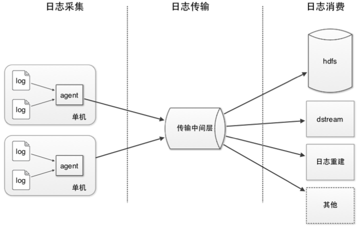

# X-lv
星律(收集日志 agent)

## 整体方案



## 相关 Wiki

[Wiki](https://github.com/meetbill/x-lv/wiki)

## 参加步骤

* 在 GitHub 上 `fork` 到自己的仓库，然后 `clone` 到本地，并设置用户信息。
```
$ git clone https://github.com/meetbill/x-lv.git
$ cd w_lib
$ git config user.name "yourname"
$ git config user.email "your email"
```
* 修改代码后提交，并推送到自己的仓库。
```
$ #do some change on the content
$ git commit -am "Fix issue #1: change helo to hello"
$ git push
```
* 在 GitHub 网站上提交 pull request。
* 定期使用项目仓库内容更新自己仓库内容。
```
$ git remote add upstream https://github.com/meetbill/x-lv.git
$ git fetch upstream
$ git checkout master
$ git rebase upstream/master
$ git push -f origin master
```
